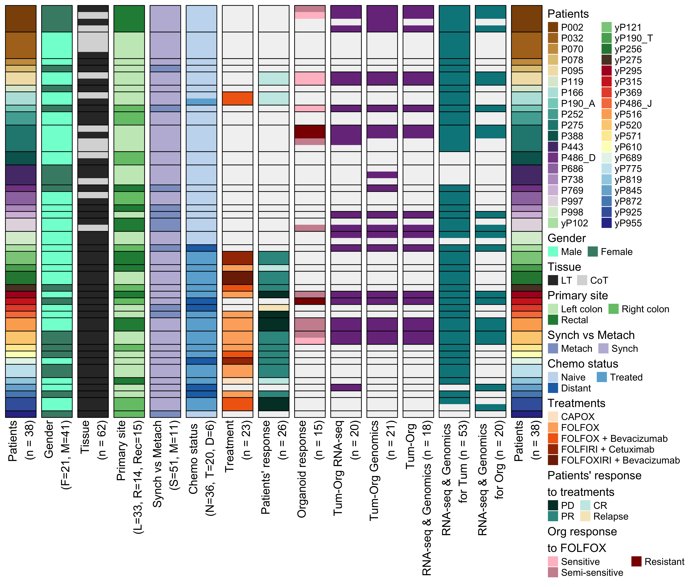

# FOLFOX_Resistant_mCRC
This repository contains R scripts, RMarkdown reports and small data dependencies associated with the manuscript: [Behrenbruch C., Foroutan M., et al](https://www.biorxiv.org/content/10.1101/2021.02.04.429849v1) (2021). 

The folders contain the below materials:

* **data**:  small data dependencies, mostly in the format of RDS files.
* **figure**: contains figures generated using the codes in the RMarkdown reports 
* **output**: processed data and tables genearted through data analyses performed in the RMarkdown reports
* **report**: RMarkdown reports, containing the main analysis codes
* **script**: a few custom functions saved as R scripts; these scripts are used in the RMarkdown reports

For any questions regarding the data analysis, please email momeneh.foroutan@monash.edu.

The figure represents a summary of different data types from tumour and organoid samples generated and analysed in this study. 

